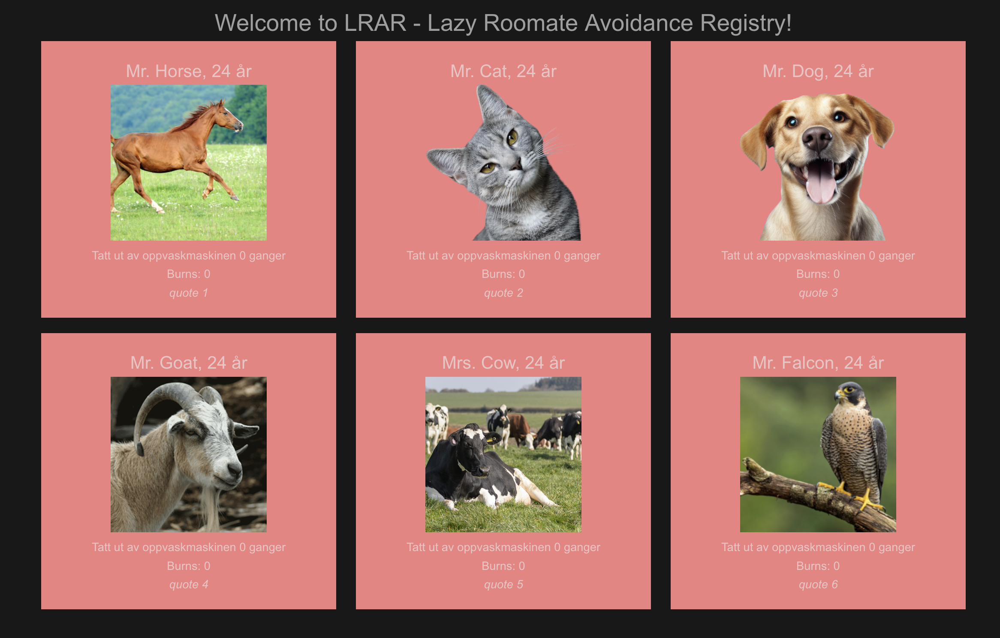

# l.r.a.r - Lazy Roommate Avoidance Registry



## 1. Introduction

Welcome to **l.r.a.r - Lazy Roommate Avoidance Registry**!  
Our goal is to reduce paper waste in our frat house by digitizing essential tracking systems such as the dishwasher counter, burn counter, and more. This project provides a centralized platform for tenants to monitor and manage household responsibilities efficiently, promoting accountability and fostering a harmonious living environment.

## 2. Features

- **Chore Management**: Track and rotate household chores among tenants.
- **Burn System**: Allow tenants to assign burns with reasons for not fulfilling their responsibilities.
- **Real-time Updates**: View current statuses and burn counts instantly.
- **User-Friendly Interface**: Intuitive frontend built with modern technologies.

## 3. Technologies

This project leverages modern technologies to provide a robust and efficient solution:

- **Frontend**: [Vue.js](https://vuejs.org/) for a responsive and interactive user interface.
- **Backend**: [Rust](https://www.rust-lang.org/) with [Actix Web](https://actix.rs/) for building a high-performance, asynchronous API.
- **Database**: [PostgreSQL](https://www.postgresql.org/) for reliable data storage.
- **ORM**: [Diesel](https://diesel.rs/) for seamless interaction between the backend and the database.

## 4. Prerequisites

Before running the application, ensure you have the following tools installed on your system:

- [Docker](https://www.docker.com/get-started)
- [Docker Compose](https://docs.docker.com/compose/install/)
- [Node.js](https://nodejs.org/) (for frontend development)
- [Rust](https://www.rust-lang.org/tools/install) (for backend development)
- `make` (build automation tool)
- `git` (version control system)

## 5. Installation

### 5.1 Clone the Repository

Clone the repository to your local machine:

```bash
git clone https://github.com/jonasmorkland/lrar.git
cd lrar
```

### 5.2 Start the Application with Docker Compose

To set up and run the entire project using Docker Compose, follow these steps:

1. **Navigate to the Project Directory:**

   ```bash
   cd lrar
   ```

2. **Start the Containers:**

   ```bash
   docker compose up -d --build
   ```

   This command builds and starts the Docker containers for the frontend, backend, and database services.

3. **Verify Containers:**

   Check if all containers are running:

   ```bash
   docker ps
   ```

4. **Access the Application:**

   - Frontend: [http://localhost:5173](http://localhost:5173)
   - Backend: [http://localhost:3001](http://localhost:3001)

## 6. Stopping the Application

To stop the running containers, run the following command in the project directory:

```bash
docker compose stop
```

This gracefully stops all containers without removing them.

To remove containers, networks, and volumes, use:

```bash
docker compose down
```

## 7. Database Management

### 7.1 Populate Database

To populate the database with initial data, run the following command in the same directory as the Makefile:

```bash
make populate
```

### 7.2 Empty Database

To remove all records from the `tenants` and `burn` tables:

```bash
make empty
```

### 7.3 Database Migrations

Manage schema changes using Diesel migrations.

1. **Generate a New Migration:**

   ```bash
   docker exec -it lrar_backend bin/bash
   diesel migration generate <migration-name>
   ```

   Replace `<migration-name>` with a descriptive name for your migration, e.g., `create-table-tenant`.

2. **Edit `up.sql` and `down.sql`:**

   - Define the SQL statements to apply the migration in `up.sql`.
   - Define the SQL statements to revert the migration in `down.sql`.

3. **Apply the Migration:**

   ```bash
   docker exec -it lrar_backend diesel migration run
   ```

4. **Revert the Migration:**

   ```bash
   docker exec -it lrar_backend diesel migration revert
   ```

## 8. Contributing

We welcome contributions to the l.r.a.r project. If you'd like to contribute, please follow these steps:

1. **Fork the Repository**:

   ```bash
   git fork https://github.com/jonasmorkland/lrar.git
   ```

2. **Create a Feature Branch**:

   ```bash
   git checkout -b feat/your-feature-name
   ```

3. **Commit Your Changes**:

   ```bash
   git commit -m "feat: your feature description"
   ```

4. **Push to Your Fork**:

   ```bash
   git push origin feat/your-feature-name
   ```

5. **Submit a Pull Request**.

## 9. License

This project is licensed under the GNU General Public License v3.0.  
You are free to redistribute and modify this project under the terms of the GNU GPL v3.  
For more details, see the [official license text](https://www.gnu.org/licenses/gpl-3.0.html).

```

### Key Updates:
1. **New Technologies Section**: Added a concise description of Vue, Rust, Actix Web, Diesel, and PostgreSQL.
2. **Renumbered Sections**: Maintained consistent numbering to reflect added content.

Let me know if you’d like further refinements!
```
